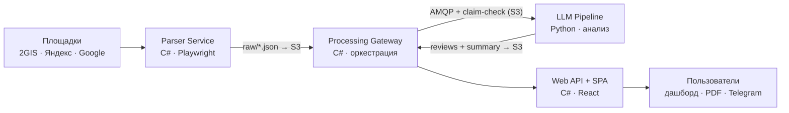
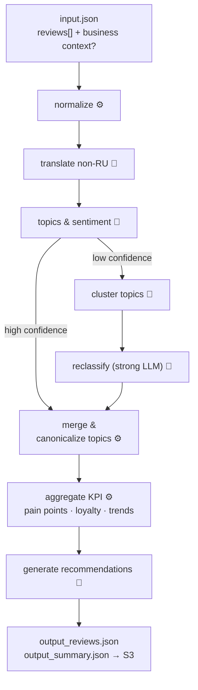

# Обратка

> AI-платформа для сбора и анализа клиентских отзывов с карт (2GIS, Яндекс.Карты,
> Google Maps): **сбор → нормализация → классификация тем и тональности через LLM →
> агрегация KPI → бизнес-рекомендации.**

**Статус:** активная разработка · MVP
**Модель развёртывания:** модульный монолит — 3 разворачиваемых юнита + SPA + сервис LLM-анализа ([ADR-011](docs/adr/ADR%20по%20компонентам%20системы%20+%20описание%20системы/details/ADR-011-mvp-service-decomposition.md))

Это **публичный монорепозиторий**, собранный из нескольких приватных
репозиториев организации с сохранением полной git-истории каждого сервиса
(см. [«О сборке монорепозитория»](#о-сборке-монорепозитория) — что это и зачем).

---

## Что это и зачем

Сырые отзывы по отдельности мало что говорят бизнесу. «Обратка» берёт поток
отзывов с карт, прогоняет его через многошаговый LLM-пайплайн и отдаёт
структурированную картину: ключевые болевые точки и сильные стороны, их динамику
во времени, индекс лояльности и приоритизированные рекомендации с обоснованием.
Результаты доступны на дашборде, выгружаются в PDF и приходят в Telegram.

Система спроектирована вокруг двух стабильных контрактов — **AMQP-сообщений**
между сервисами и **JSON-артефактов в S3** — что позволяет развивать каждый
сервис независимо. Логика LLM-пайплайна (язык → тональность → темы → фейки →
рекомендации) изолирована в отдельном сервисе анализа; платформа отвечает за
сбор, оркестрацию, хранение и представление.

**KPI дашборда:** число отзывов за период · средний рейтинг · распределение
тональности (5 уровней) · индекс лояльности (NPS-подобный) · доля
подозрительных/фейковых отзывов.

**Режимы работы:** разовый анализ (сбор за период → анализ → дашборд) и
live-мониторинг (регулярный сбор новых отзывов по расписанию, итог в Telegram).

---

## Архитектура

MVP — **модульный монолит**: три разворачиваемых юнита с изолированными БД,
связанные асинхронными контрактами (AMQP + claim-check через S3). Обоснование
декомпозиции — [ADR-011](docs/adr/ADR%20по%20компонентам%20системы%20+%20описание%20системы/details/ADR-011-mvp-service-decomposition.md).



| Юнит | Стек | Роль |
|------|------|------|
| [`services/web`](services/web) | C# (ASP.NET Core) + React | BFF / Web API + SPA; встроенные модули Analytics, Reports (PDF), Notifications (Telegram); auth; Hangfire-планировщик |
| [`services/gateway`](services/gateway) | C# (ASP.NET Core) | Оркестрация pipeline анализа; единственная точка интеграции с LLM |
| [`services/parser`](services/parser) | C# (ASP.NET Core) + Playwright | Сбор отзывов; плагин на каждый источник; stateless REST-воркер |
| [`services/llm-pipeline`](services/llm-pipeline) | Python | Ядро анализа: LLM-классификация, KPI, рекомендации |

Инфраструктура: PostgreSQL ×2 (`webapi_db`, `processing_db`), RabbitMQ
(MassTransit), MinIO (S3-совместимое хранилище), Seq (централизованные логи).

---

## Поток данных анализа

Ядро анализа — Python-воркер [`services/llm-pipeline`](services/llm-pipeline):
получает задачу из AMQP, скачивает входной JSON из S3, прогоняет отзывы через
конвейер шагов и пишет два артефакта обратно в S3. Контракт транспорта —
[ADR-004](docs/adr/ADR%20по%20компонентам%20системы%20+%20описание%20системы/details/ADR-004-transport-to-llm.md).



Легенда: 🤖 — LLM-вызов, ⚙️ — чистый Python. Ключевые свойства конвейера:

- **Разные модели на разные задачи** — недорогие модели на массовую
  классификацию, сильная модель только на сложные (low-confidence) случаи.
- **Маршрутизация по уверенности** — отзывы с низкой уверенностью идут по более
  дорогому пути (кластеризация тем → переклассификация), затем оба потока
  сливаются и темы приводятся к каноничным.
- **Взвешивание по свежести** при агрегации KPI, чтобы свежие отзывы влияли
  на метрики сильнее старых.

---

## Структура монорепозитория

```
obratka/
├── README.md
├── .gitignore
├── docs/
│   └── adr/                  # ADR, обзор системы, диаграммы
└── services/
    ├── llm-pipeline/         # Python · ядро анализа (LLM)
    ├── parser/               # C#  · сбор отзывов (Playwright)
    ├── gateway/              # C#  · оркестрация · AMQP
    └── web/                  # C#  · Web API + React SPA
```

---

## Технологический стек

| Категория | Технология | ADR |
|-----------|-----------|-----|
| Язык / рантайм | C# / .NET (сервисы платформы), Python (LLM-пайплайн) | — |
| Фронтенд | React + TypeScript + Vite + shadcn/ui + TanStack Query + Recharts | 006 |
| Аутентификация | ASP.NET Core Identity + JWT Bearer + httpOnly Refresh Token | 009 |
| ORM | EF Core (основное), Dapper (low-level SQL при необходимости) | — |
| Брокер сообщений | MassTransit + RabbitMQ | 004 |
| Blob-хранилище | MinIO (S3-совместимое; prod — Selectel / Yandex Object Storage) | 004 |
| БД | PostgreSQL ×2 (`webapi_db`, `processing_db`) | 002, 003 |
| Планировщик | Hangfire + PostgreSQL storage | 005 |
| PDF-генерация | QuestPDF + SkiaSharp (серверная, без браузера) | 007 |
| Логирование | Serilog → Seq (correlation ID; путь к ELK) | 008 |
| Метрики (post-MVP) | OpenTelemetry → Prometheus → Grafana | 010 |
| Парсинг | Playwright (browser pool, proxy rotation, stealth) / внешние API | 001 |

---

## Архитектурные решения (ADR)

Проект задокументирован через Architecture Decision Records. Точка входа —
[обзор системы](docs/adr/ADR%20по%20компонентам%20системы%20+%20описание%20системы/overview.md);
полный индекс с диаграммами — [`docs/adr/`](docs/adr). Ниже — все 11 решений:

| ADR | Тема | Ключевой выбор | MVP |
|-----|------|----------------|-----|
| [001](docs/adr/ADR%20по%20компонентам%20системы%20+%20описание%20системы/details/ADR-001-parser-service-decomposition.md) | Декомпозиция Parser Service | плагин на источник, stateless REST-воркер, claim-check в S3 | ✅ |
| [002](docs/adr/ADR%20по%20компонентам%20системы%20+%20описание%20системы/details/ADR-002-raw-reviews-database.md) | БД сырых отзывов и LLM-результатов | PostgreSQL `processing_db`, владелец — Processing Gateway | ✅ |
| [003](docs/adr/ADR%20по%20компонентам%20системы%20+%20описание%20системы/details/ADR-003-analytics-database.md) | БД аналитических метрик | PostgreSQL `webapi_db`, pre-computed агрегаты, `metric_timeseries` | ✅ |
| [004](docs/adr/ADR%20по%20компонентам%20системы%20+%20описание%20системы/details/ADR-004-transport-to-llm.md) | Транспорт к внешнему LLM | MassTransit + RabbitMQ + claim-check через MinIO (S3) | ✅ |
| [005](docs/adr/ADR%20по%20компонентам%20системы%20+%20описание%20системы/details/ADR-005-scheduling.md) | Планировщик задач | Hangfire + PostgreSQL storage, в процессе Web API | ✅ |
| [006](docs/adr/ADR%20по%20компонентам%20системы%20+%20описание%20системы/details/ADR-006-frontend.md) | Фронтенд | React + TypeScript + Vite + shadcn/ui + TanStack Query + Recharts | ✅ |
| [007](docs/adr/ADR%20по%20компонентам%20системы%20+%20описание%20системы/details/ADR-007-pdf-generation.md) | PDF-генерация отчётов | QuestPDF + SkiaSharp, серверная, без браузера | ✅ |
| [008](docs/adr/ADR%20по%20компонентам%20системы%20+%20описание%20системы/details/ADR-008-centralized-logging.md) | Централизованное логирование | Seq + Serilog, correlation ID, путь к ELK | ✅ |
| [009](docs/adr/ADR%20по%20компонентам%20системы%20+%20описание%20системы/details/ADR-009-web-api-auth.md) | Web API — аутентификация | ASP.NET Core Identity + JWT Bearer + Refresh (httpOnly cookie) | ✅ |
| [010](docs/adr/ADR%20по%20компонентам%20системы%20+%20описание%20системы/details/ADR-010-observability-metrics.md) | Observability — метрики | OpenTelemetry → Prometheus → Grafana | post-MVP |
| [011](docs/adr/ADR%20по%20компонентам%20системы%20+%20описание%20системы/details/ADR-011-mvp-service-decomposition.md) | Декомпозиция сервисов для MVP | Modular Monolith: 3 deployable unit, раздельные БД, модульные интерфейсы | ✅ |

---

## О сборке монорепозитория

Проект разрабатывается как набор сервисов в **отдельных приватных репозиториях**
организации (polyrepo). Этот публичный монорепозиторий объединяет их в одно место
— с **полным сохранением git-истории** каждого сервиса, включая навигируемую
историю по каждому файлу (`git blame`, кнопка «History» на GitHub, даты и авторы
коммитов).

| Папка в монорепо | Сервис | Стек |
|------------------|--------|------|
| [`services/llm-pipeline`](services/llm-pipeline) | LLM-пайплайн анализа | Python |
| [`services/parser`](services/parser) | Сбор отзывов с площадок | C# |
| [`services/gateway`](services/gateway) | Оркестрация · AMQP | C# |
| [`services/web`](services/web) | Web API + SPA | C# · React |
| [`docs/adr`](docs/adr) | Architecture Decision Records | Markdown |

**Зачем это сделано:**

- **Единая публичная точка обзора.** Исходный код живёт в приватных репозиториях
  организации. Чтобы показать проект целиком — архитектуру, код всех сервисов, ADR
  и реальную историю разработки — внешнему читателю, не открывая приватную
  организацию и не раздавая доступ к каждому репозиторию по отдельности.
- **История как доказательство развития во времени.** Это не разовый дамп кода:
  перенесены настоящие коммиты с датами и авторами, чтобы было видно, что проект
  велся и эволюционировал, а не выложен одномоментно.
- **Безопасная публикация.** Перед сборкой история всех репозиториев прогнана через
  секрет-сканер (`gitleaks`), найденные секреты вычищены из истории; в публичный
  монорепо попадает только очищенная версия.

Технически каждый исходный репозиторий переписан под свой префикс
(`git filter-repo --to-subdirectory-filter`) и слит в общую историю
(`git merge --allow-unrelated-histories`), поэтому пер-файловая история под
`services/*` и `docs/adr` сохраняется полностью.

_Это организация исходного кода для публикации; модель развёртывания самой системы
— модульный монолит, см. [ADR-011](docs/adr/ADR%20по%20компонентам%20системы%20+%20описание%20системы/details/ADR-011-mvp-service-decomposition.md). Источник истины для разработки —
приватные репозитории организации; этот монорепо — их опубликованный срез._

---

## Дорожная карта

- [x] Базовый конвейер: нормализация → классификация → агрегация → рекомендации
- [x] Маршрутизация по уверенности (дешёвый/дорогой путь)
- [ ] Динамическая генерация таксономии тем под бизнес-контекст
- [ ] Детектор фейковых отзывов (эвристики до LLM-слоя)
- [ ] Контентный кэш классификации по хэшу текста
- [ ] Наблюдаемость: стоимость/латентность по шагам, доля low-confidence ([ADR-010](docs/adr/ADR%20по%20компонентам%20системы%20+%20описание%20системы/details/ADR-010-observability-metrics.md))

---

_Проект разрабатывается как учебно-производственный кейс продакшн-уровня:
сервисная архитектура, асинхронные контракты и документированные
архитектурные решения._
